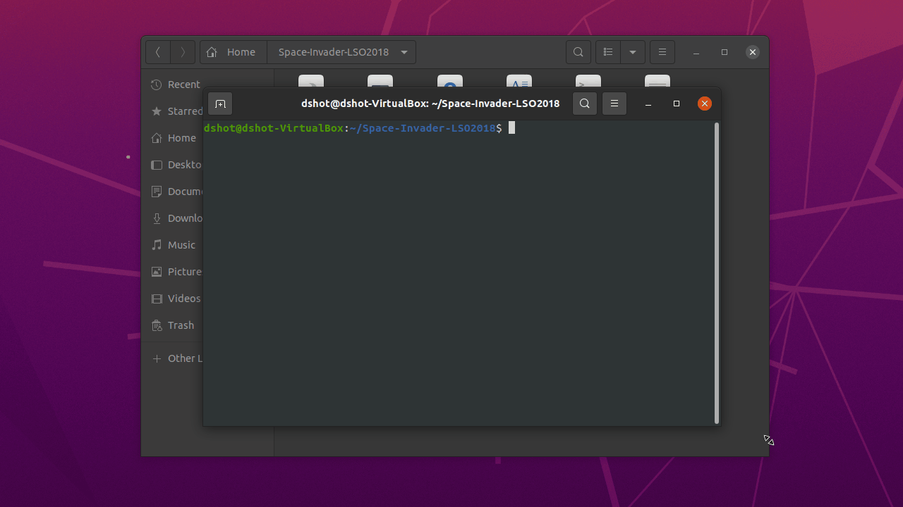

# Space-Invader-LSO2018

Space-Invader game written in C, for getting to know the [ncurses](https://invisible-island.net/ncurses/) and [p-thread](https://www.cs.cmu.edu/afs/cs/academic/class/15492-f07/www/pthreads.html) library.

The final project in Operating System course at the 2nd year of Computer Science at the University of Cagliari, so to better undersand the mechanisms around an operating system ways to interrupt the code flow inside a software, both at low and high level of abstraction.

# Install

Clone repo then run commands:

```bash
sudo apt install -y libpthread-stubs0-dev libncurses5-dev build-essential
chmod +x space_invaders.sh
./space_invaders.sh
```

------


| Commands                          | Cheats                                            |
| :-------------------------------- | :------------------------------------------------ |
| <kbd>Space</kbd> - Select / Shoot | <kbd>P</kbd> - Increase Life +1                   |
| **<kbd>W</kbd>** - Up             | **<kbd>L</kbd>** - Decrease Life -1               |
| **<kbd>A</kbd>** - Left           | **<kbd>K</kbd>** - Increase Missile +1            |
| **<kbd>S</kbd>** - Down           | **<kbd>U</kbd>** - Get EMP                        |
| **<kbd>S</kbd>** - Right          | **<kbd>J</kbd>** - Get Shield                     |
| **<kbd>Q</kbd>** - Up Left        | **<kbd>I</kbd>** - Decrease (All) enemies life -1 |
| <kbd>E</kbd> - Up Right           |                                                   |
| **<kbd>F</kbd>** - Activate EMP   |                                                   |
| **<kbd>M</kbd>** - Shoot Missile  |                                                   |

# Example Video

